# Práctica

Antes de empezar la tarea, se creara un nuevo usuario en la maquina virtual con el nombre del alumno. Para ello utilizaremos el comando su - para acceder a root y poder crear el nuevo usuario con su contraseña.

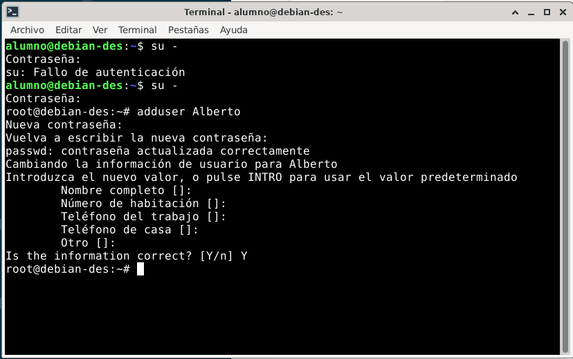

Ahora, al entrar con el nuevo usuario intentaremos usar la terminal para instalar primero JDK.
No nos dejará debido a que el nuevo usuario no tendrá permisos de sudo para ejecutar comandos, por lo que primero habrá que darle permisos para ello.

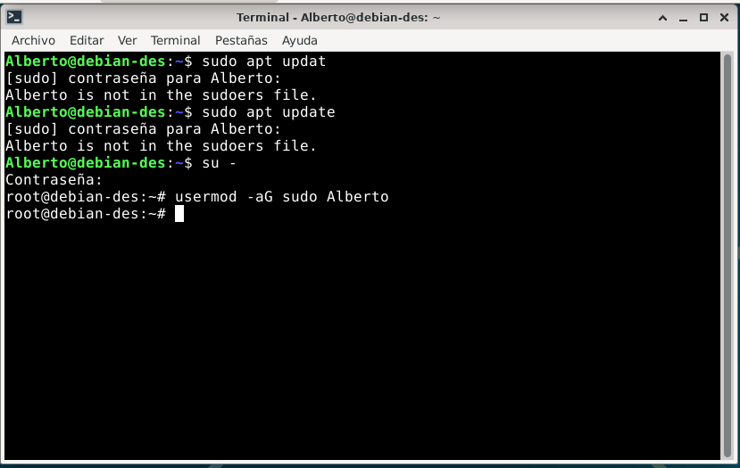

Después de haber dados los permisos, comprobaremos si hay un jdk y Maven, Maven no se encuentra instalado por lo que usaremos estos comandos:

```bash
sudo apt install & sudo apt install -y maven
```

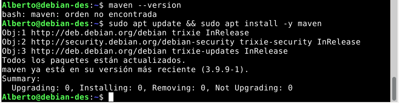

En cuanto al java, se encuentra el 21 en la maquina virtual aunque luego en el proyecto que creemos se usará el 17.

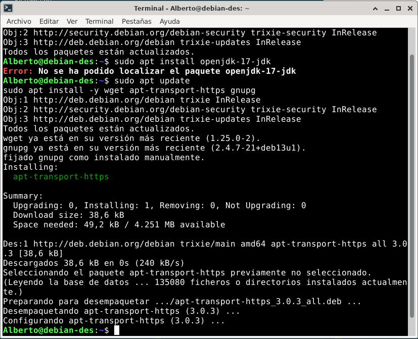

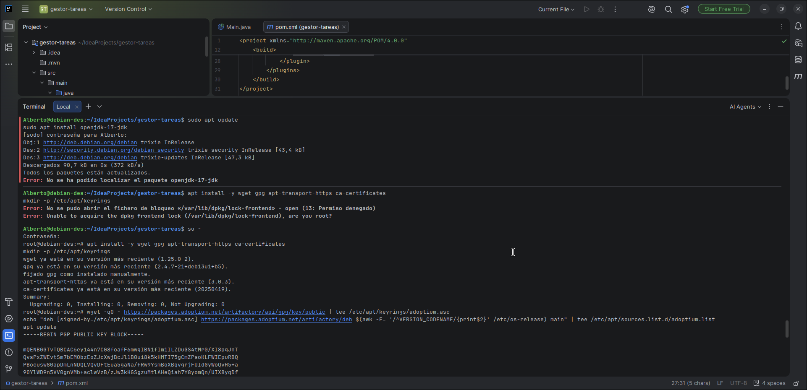

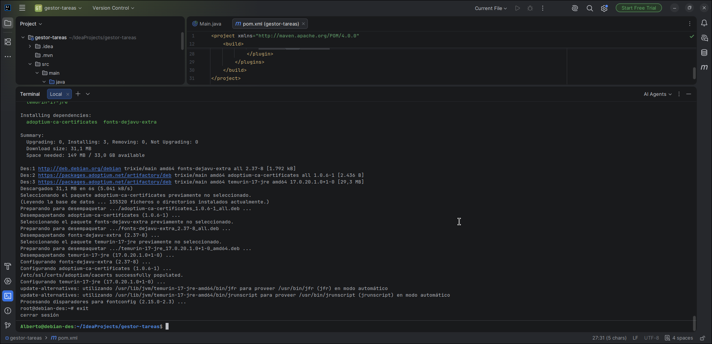

Para trabaja con el código se instalará el intellij con este comando:

```bash
sudo snap install intellij-idea-ultimate --classic
```

Empezaremos creando la estructura del proyecto como se nos ha descrito en la actividad y la modificacion del pom, además de la modificacion del Main.

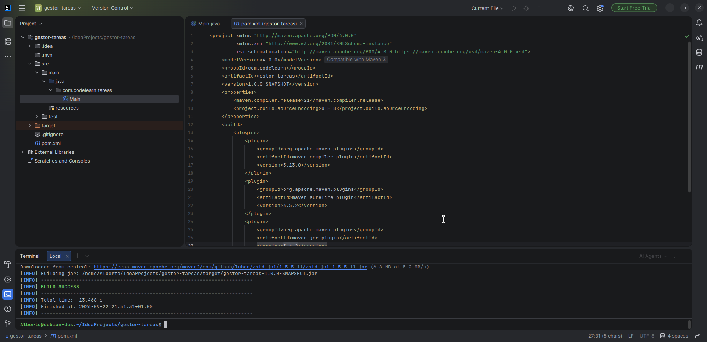

Se nos imprimira un mensaje al ejecutar este codigo:

```bash
mvn compile
java -cp target/classes com.codelearn.tareas.Main
find target/classes -type f
```

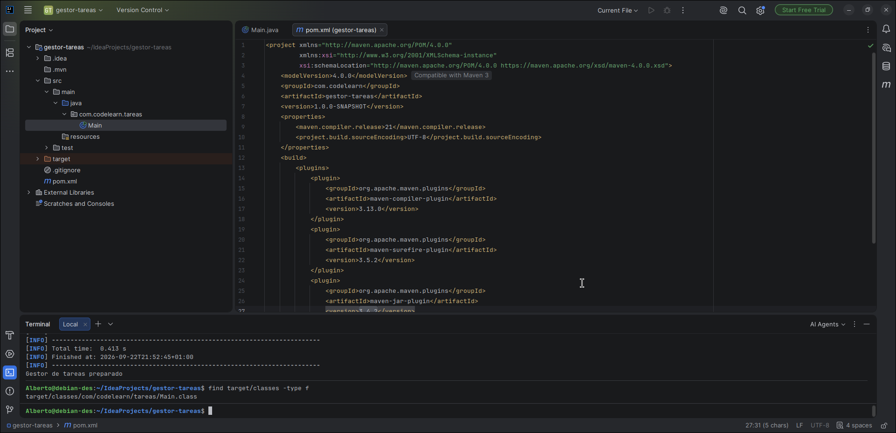

Ejecutaremos clean que eliminara los resultados anteriores y nos dará unos nuevos.

Hemos incorporado gson, se modificará el Main y se comprobará como Maven configura el classpath de compilación

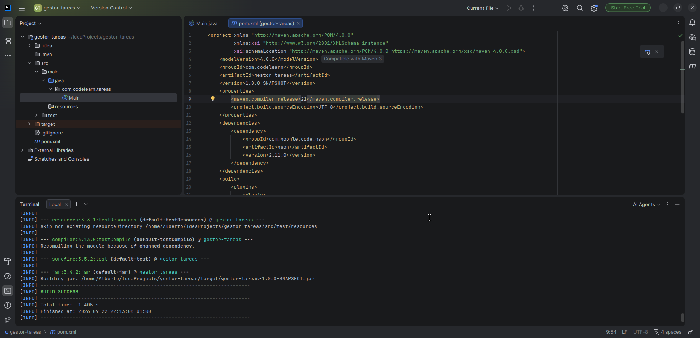

Se han buscado los archivos solicitados y se ha visto como install actua sobre un repositorio local.

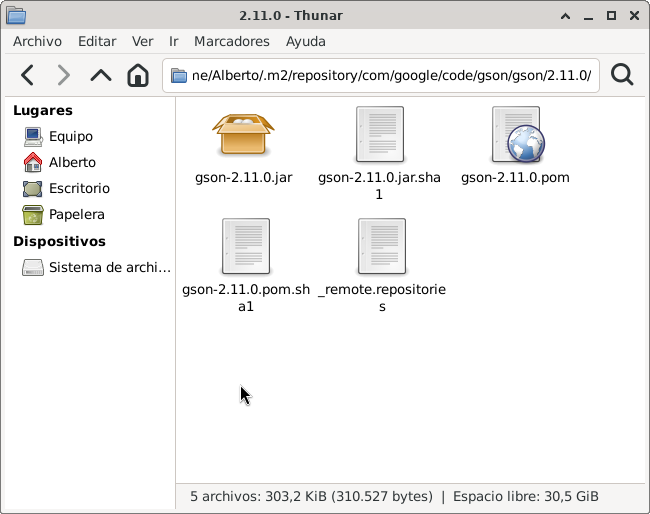

Se ha creado la carpeta config con settings-publico.xml y se ha obtenido repositorio publico entre los perfiles activos.

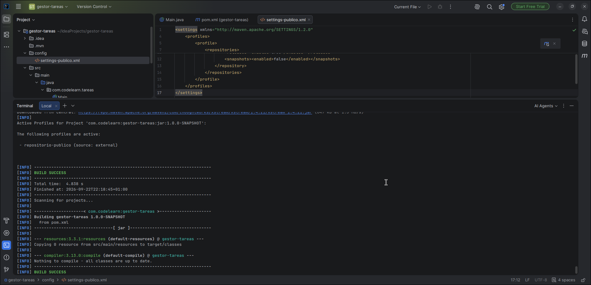

Se ha modificado el pon con lo siguiente:

```xml
<profiles>
  <profile>
    <id>distribucion</id>
    <build>
      <plugins>
        <plugin>
          <groupId>org.apache.maven.plugins</groupId>
          <artifactId>maven-shade-plugin</artifactId>
          <version>3.6.0</version>
          <executions>
            <execution>
              <phase>package</phase>
              <goals><goal>shade</goal></goals>
              <configuration>
                <shadedArtifactAttached>true</shadedArtifactAttached>
                <shadedClassifierName>all</shadedClassifierName>
                <createDependencyReducedPom>false</createDependencyReducedPom>
                <transformers>
                  <transformer implementation="org.apache.maven.plugins.shade.resource.ManifestResourceTransformer">
                    <mainClass>com.codelearn.tareas.Main</mainClass>
                  </transformer>
                </transformers>
              </configuration>
            </execution>
          </executions>
        </plugin>
      </plugins>
    </build>
  </profile>
  <profile>
    <id>informe</id>
    <properties>
      <maven.compiler.showWarnings>true</maven.compiler.showWarnings>
    </properties>
  </profile>
</profiles>
```

Con esta modificacion podremos utilizar perfilespara variantes de construccion.

Se ha añadido temporalmente a las dependencias lo siguiente:

```xml
<dependency>
  <groupId>org.apache.commons</groupId>
  <artifactId>commons-text</artifactId>
  <version>1.12.0</version>
</dependency>
<dependency>
  <groupId>org.apache.commons</groupId>
  <artifactId>commons-lang3</artifactId>
  <version>3.14.0</version>
</dependency>
```

Se ha observado el árbol de dependencias y se ha usado para comprobar el resultado:

```bash
mvn dependency:tree -Dverbose -Dincludes=org.apache.commons
```

A continuación se ha añadido al pom:

```xml
<gson.version>2.11.0</gson.version>
<junit.version>5.11.0</junit.version>
<maven-compiler-plugin.version>3.13.0</maven-compiler-plugin.version>
<maven-surefire-plugin.version>3.5.2</maven-surefire-plugin.version>
<maven-jar-plugin.version>3.4.2</maven-jar-plugin.version>
<maven-shade-plugin.version>3.6.0</maven-shade-plugin.version>
<maven-dependency-plugin.version>3.8.1</maven-dependency-plugin.version>
<maven-wrapper-plugin.version>3.3.2</maven-wrapper-plugin.version>
```

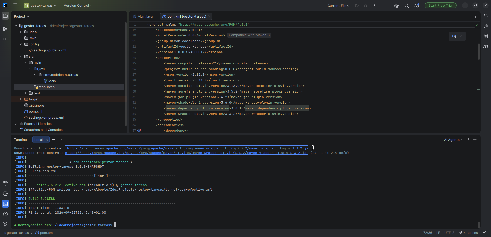

También se añadio:

```xml
<dependencyManagement>
  <dependencies>
    <dependency>
      <groupId>com.google.code.gson</groupId>
      <artifactId>gson</artifactId>
      <version>${gson.version}</version>
    </dependency>
    <dependency>
      <groupId>org.junit</groupId>
      <artifactId>junit-bom</artifactId>
      <version>${junit.version}</version>
      <type>pom</type>
      <scope>import</scope>
    </dependency>
  </dependencies>
</dependencyManagement>
```

Se han modificados algunos plugins para que obtengan la version de lo anterior puesto y se han añadido dos plugins para que los comandos posteriores utilicen las versiones declaradas:

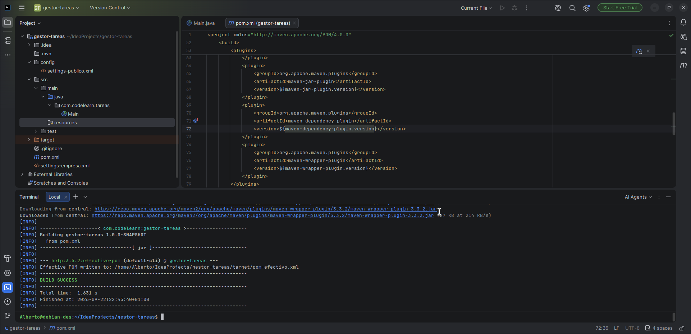

```xml
<plugin>
  <groupId>org.apache.maven.plugins</groupId>
  <artifactId>maven-dependency-plugin</artifactId>
  <version>${maven-dependency-plugin.version}</version>
</plugin>
<plugin>
  <groupId>org.apache.maven.plugins</groupId>
  <artifactId>maven-wrapper-plugin</artifactId>
  <version>${maven-wrapper-plugin.version}</version>
</plugin>
```

Se han añadido al pom las dependencias de junit para los tests y se ha modificado el main con lo siguiente:

```java
package com.codelearn.tareas;

import java.util.ArrayList;
import java.util.List;

public class GestorTareas {
    private final List<String> titulos = new ArrayList<>();

    public void anadir(String titulo) {
        if (titulo == null || titulo.isBlank()) {
            throw new IllegalArgumentException("El título es obligatorio");
        }
        titulos.add(titulo);
    }

    public List<String> listar() {
        return List.copyOf(titulos);
    }
}
```

y se ha creado el test correspondiente al main, comprobando en el proceso su funcionamiento.

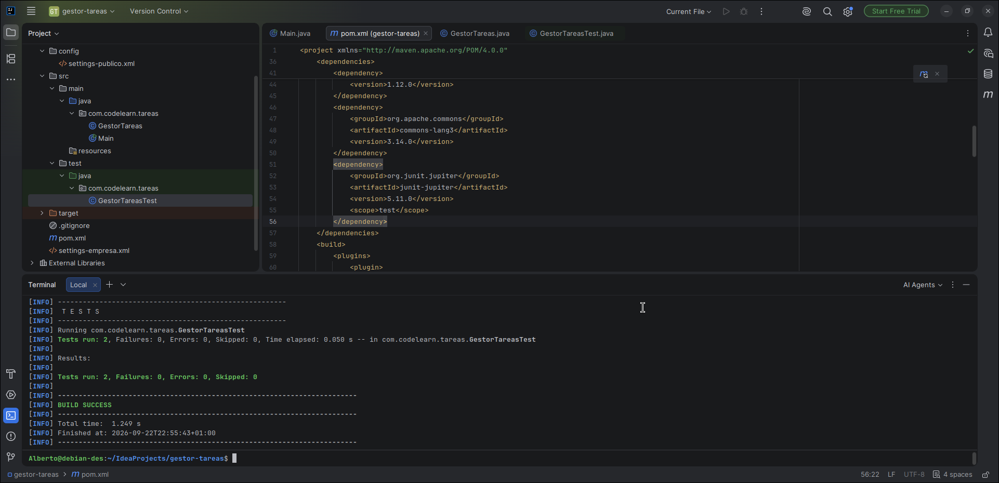

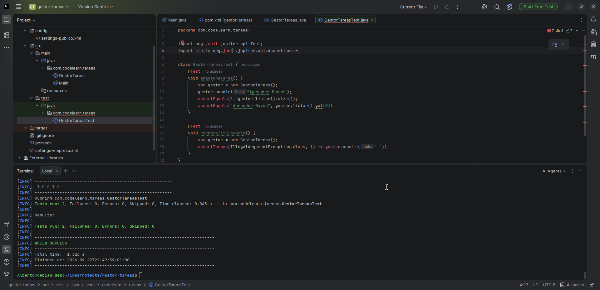

Se ha comprobado un error a la hora de compilar ya se debia comprobar que pasaba cuando quitabamos titulos.add(titulo) del main.

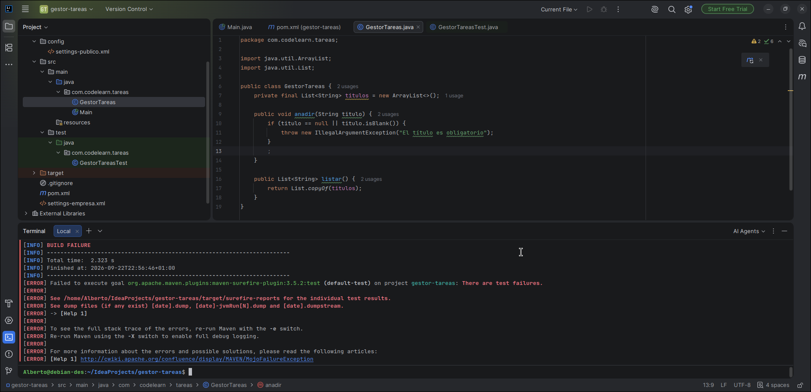

Se ha creado el aplicacion.properties y se ha puesto en el nombre=Gestor de tareas. Tambien se ha vuelto a modificar el main con lo siguiente:

```java
package com.codelearn.tareas;

import com.google.gson.Gson;
import java.io.IOException;
import java.util.Map;
import java.util.Properties;

public class Main {
    public static void main(String[] args) throws IOException {
        var config = new Properties();
        try (var entrada = Main.class.getResourceAsStream("/aplicacion.properties")) {
            if (entrada == null) {
                throw new IOException("Falta aplicacion.properties en el classpath");
            }
            config.load(entrada);
        }
        System.out.println(new Gson().toJson(Map.of("nombre", config.getProperty("nombre"))));
    }
}
```

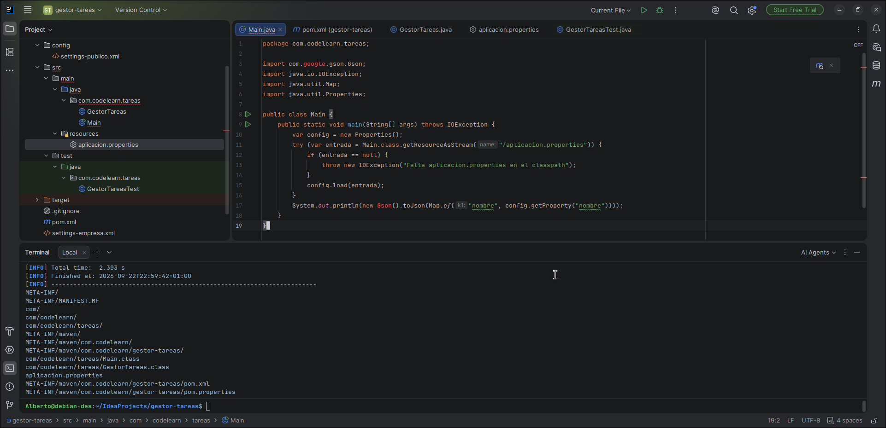

Se ha obtenido el mensaje correspondiente al ejecutar:

```bash
mvn clean package
jar tf target/gestor-tareas-1.0.0-SNAPSHOT.jar
```

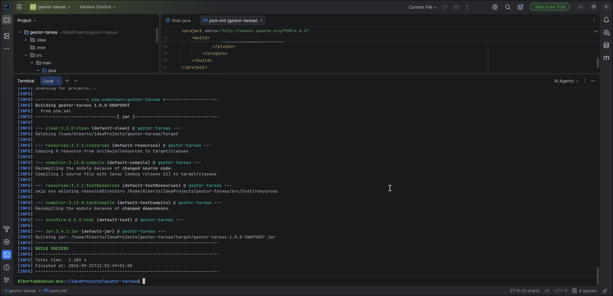

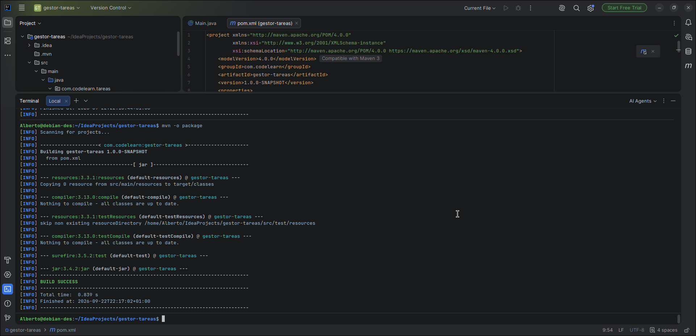

Se ha vuelto a modificar el pom con:

```xml
<configuration>
  <archive>
    <manifest>
      <mainClass>com.codelearn.tareas.Main</mainClass>
    </manifest>
  </archive>
</configuration>
```

y se ha ejecutado con los siguientes comandos:

```bash
mvn clean package
jar tf target/gestor-tareas-1.0.0-SNAPSHOT.jar
mvn dependency:copy-dependencies -DincludeScope=runtime -DoutputDirectory=target/lib
java -cp "target/gestor-tareas-1.0.0-SNAPSHOT.jar:target/lib/*" com.codelearn.tareas.Main
```

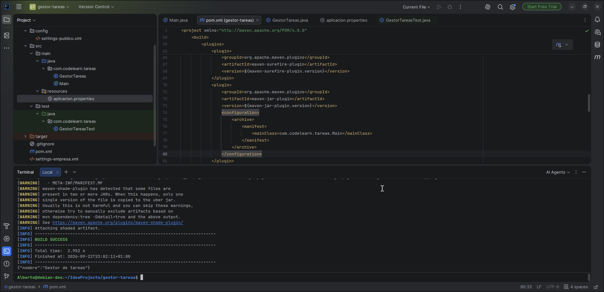

Al hacer esto nos ha imprimido un JSON que pone Gestor de tareas.
